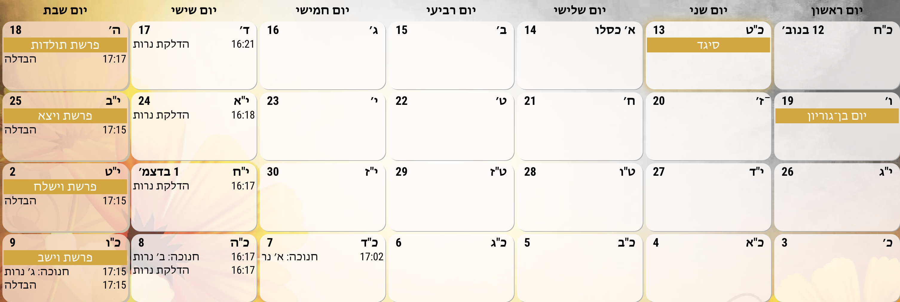

# Module: MMM-HebrewCalendar

This MagicMirror² module displays a Hebrew calendar with your events in a monthly or weekly calendar view.  
It is based on the work of kolbyjack on MMM-MonthlyCalendar.



## Installation

In your terminal, go to your MagicMirror's `modules` folder:

```
cd ~/MagicMirror/modules
```

Clone this repository:

```
git clone https://github.com/neshkoli/MMM-HebrewCalendar.git
```

## Using the module

To use this module, add it to the `modules` array in your `config/config.js` file:

```javascript
modules: [
  {
    module: "MMM-HebrewCalendar",
    position: "bottom_bar",
    config: { // See "Configuration options" below.
      mode: "fourWeeks",
      // Optional: Add Hebrew birthdays
      hebrewBirthdays: [
        { name: "David", hebrewMonth: "ניסן", hebrewDay: 5 }
      ]
    }
  }
]
```

You may also want to set `"broadcastPastEvents": true` in your [calendar module configuration](https://docs.magicmirror.builders/modules/calendar.html#configuration-options) so past events are still displayed.

## Configuration options

| Option              | Default           | Description                                                                                      |
|---------------------|-------------------|--------------------------------------------------------------------------------------------------|
| `mode`              | `"fourWeeks"`     | Calendar view: `lastMonth`, `currentMonth`, `nextMonth`, `currentWeek`, `twoWeeks`, `threeWeeks`, `fourWeeks` |
| `displaySymbol`     | `false`           | Show symbols next to events.                                                                     |
| `firstDayOfWeek`    | `"sunday"`        | Start of the week: `"sunday"`, `"monday"`, or `"today"` (current day in first column).           |
| `hideCalendars`     | `[]`              | List of calendar names to hide from the view.                                                    |
| `wrapTitles`        | `true`            | Allow event titles to wrap or truncate.                                                          |
| `hebrewBirthdays`   | `[]`              | Array of objects: `{ name: "Name", hebrewMonth: "MonthName", hebrewDay: DayNumber }`             |

### Hebrew Birthdays

You can display recurring Hebrew birthdays by adding them to the `hebrewBirthdays` array in your config.  
Example:

```javascript
hebrewBirthdays: [
  { name: "David", hebrewMonth: "ניסן", hebrewDay: 5 },
  { name: "Sarah", hebrewMonth: "תשרי", hebrewDay: 12 }
]
```

## Notes

- After starting MagicMirror, it may take a few seconds before events appear.
- The module supports both Gregorian and Hebrew events.
- For best results, use with the default MagicMirror calendar module for event sources.

---
