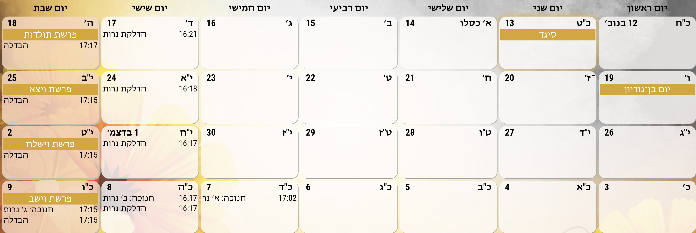

# ⚠️ URGENT TROUBLESHOOTING FOR NODE_HELPER

If the Jewish holidays aren't appearing, follow these steps:

1. **Install dependencies**: The module requires the hebcal library
   ```bash
   cd ~/MagicMirror/modules/MMM-HebrewCalendar
   npm install
   ```

2. **Check logs**: Run MagicMirror with more verbose logs
   ```bash
   cd ~/MagicMirror
   npm start -- --debug
   ```

3. **Restart MagicMirror**: After making any changes, restart completely
   ```bash
   # Press Ctrl+C to stop MagicMirror, then:
   npm start
   ```

4. **Check for typos**: Ensure your directory structure has the exact names:
   ```
   MagicMirror/modules/MMM-HebrewCalendar/node_helper.js
   MagicMirror/modules/MMM-HebrewCalendar/MMM-HebrewCalendar.js
   ```

# Module: MMM-HebrewCalendar

This MagicMirror² module displays a Hebrew calendar with your events in a monthly or weekly calendar view.  
It is based on the work of kolbyjack on MMM-MonthlyCalendar.



## Installation

In your terminal, go to your MagicMirror's `modules` folder:

```bash
cd ~/MagicMirror/modules
git clone https://github.com/neshkoli/MMM-HebrewCalendar.git
cd MMM-HebrewCalendar
npm install            # install hebcal dependency
```

## Using the module

To use this module, add it to the `modules` array in your `config/config.js` file:

```javascript
modules: [
  {
    module: "MMM-HebrewCalendar",
    position: "bottom_bar",
    config: { // See "Configuration options" below.
      mode: "fourWeeks",
      // Optional: Configure location (defaults to Tel Aviv, Israel)
      location: {
        latitude: 40.7128,
        longitude: -74.0060,
        name: "New York",
        countryCode: "US", 
        timezone: "America/New_York",
        israelObservance: false
      },
      // Optional: Add Hebrew annual events
      hebrewEvents: [
        { name: "David", hebrewMonth: "ניסן", hebrewDay: 5, type: "birthday" },
        { name: "Wedding", hebrewMonth: "אייר", hebrewDay: 12, type: "anniversary" },
        { name: "Grandpa", hebrewMonth: "תמוז", hebrewDay: 20, type: "memorial" },
        { name: "Special Day", hebrewMonth: "טבת", hebrewDay: 10, type: "other" }
      ]
    }
  }
]
```

You may also want to set `"broadcastPastEvents": true` in your [calendar module configuration](https://docs.magicmirror.builders/modules/calendar.html#configuration-options) so past events are still displayed.

## Configuration options

| Option              | Default           | Description                                                                                      |
|---------------------|-------------------|--------------------------------------------------------------------------------------------------|
| `mode`              | `"fourWeeks"`     | Calendar view: `lastMonth`, `currentMonth`, `nextMonth`, `currentWeek`, `twoWeeks`, `threeWeeks`, `fourWeeks` |
| `displaySymbol`     | `true`            | Show symbols next to events.                                                                     |
| `firstDayOfWeek`    | `"sunday"`        | Start of the week: `"sunday"`, `"monday"`, or `"today"` (current day in first column).           |
| `hideCalendars`     | `[]`              | List of calendar names to hide from the view.                                                    |
| `wrapTitles`        | `true`            | Allow event titles to wrap or truncate.                                                          |
| `hebrewEvents`      | `[]`              | Array of objects: `{ name: "Name", hebrewMonth: "MonthName", hebrewDay: DayNumber, type: "birthday"|"anniversary"|"memorial"|"other" }`             |
| `location`          | Tel Aviv, Israel  | Location for Jewish holidays and candle lighting times. See [Location Configuration](#location-configuration) below. |
| `noModern`          | `false`           | Set to `true` to hide modern Israeli holidays (Ben Gurion Day, Sigd, Yom HaAtzmaut, etc.)       |
| `noMinorFast`       | `false`           | Set to `true` to hide minor fast days.                                                           |
| `noRoshChodesh`     | `false`           | Set to `true` to hide Rosh Chodesh (new month) events.                                          |

### Location Configuration

The module uses location data to provide accurate Jewish holiday observance and candle lighting times. By default, it uses Tel Aviv, Israel settings.

#### Default Location (Tel Aviv, Israel)
```javascript
location: {
  latitude: 32.0853,
  longitude: 34.7818,
  name: "Tel Aviv",
  countryCode: "IL",
  timezone: "Asia/Jerusalem",
  israelObservance: true
}
```

#### Custom Location Examples

**New York, USA:**
```javascript
location: {
  latitude: 40.7128,
  longitude: -74.0060,
  name: "New York",
  countryCode: "US",
  timezone: "America/New_York",
  israelObservance: false
}
```

**London, UK:**
```javascript
location: {
  latitude: 51.5074,
  longitude: -0.1278,
  name: "London",
  countryCode: "GB",
  timezone: "Europe/London",
  israelObservance: false
}
```

**Jerusalem, Israel:**
```javascript
location: {
  latitude: 31.7683,
  longitude: 35.2137,
  name: "Jerusalem",
  countryCode: "IL",
  timezone: "Asia/Jerusalem",
  israelObservance: true
}
```

#### Location Configuration Options

| Option              | Type      | Description                                                                           |
|---------------------|-----------|--------------------------------------------------------------------------------------|
| `latitude`          | `number`  | Latitude coordinate (required)                                                       |
| `longitude`         | `number`  | Longitude coordinate (required)                                                      |
| `name`              | `string`  | Location name for display purposes (required)                                       |
| `countryCode`       | `string`  | Two-letter country code (e.g., "IL", "US", "GB")                                   |
| `timezone`          | `string`  | Timezone identifier (e.g., "Asia/Jerusalem", "America/New_York")                   |
| `israelObservance`  | `boolean` | Use Israel observance rules (affects holiday duration and candle lighting times)   |

**Note:** Setting `israelObservance: true` enables Israeli holiday observance (e.g., one-day holidays instead of two-day diaspora observance) and uses Israeli candle lighting customs (18 minutes before sunset).

### Hebrew Annual Events

You can display recurring Hebrew annual events (birthdays, anniversaries, memorials, or other) by adding them to the `hebrewEvents` array in your config.  
Supported types and their emojis:
- `birthday`: 🎂
- `anniversary`: 💍
- `memorial`: 🕯️
- `other`: ⭐

Example:

```javascript
hebrewEvents: [
  { name: "David", hebrewMonth: "ניסן", hebrewDay: 5, type: "birthday" },
  { name: "Sarah & Eli", hebrewMonth: "תשרי", hebrewDay: 12, type: "anniversary" },
  { name: "Grandma", hebrewMonth: "אדר", hebrewDay: 18, type: "memorial" },
  { name: "Special Day", hebrewMonth: "טבת", hebrewDay: 10, type: "other" }
]
```

**Supported Hebrew Month Names:**
- תשרי (Tishrei), חשוון (Cheshvan), כסלו (Kislev), טבת (Tevet)
- שבט (Shevat), אדר (Adar), ניסן (Nisan), אייר (Iyyar)  
- סיוון (Sivan), תמוז (Tammuz), אב (Av), אלול (Elul)

**Note:** Both Hebrew names (e.g., "סיוון") and English names (e.g., "Sivan") are supported for backward compatibility.

### Filtering Jewish Holidays

You can filter out certain types of Jewish holidays and events:

```javascript
{
  module: "MMM-HebrewCalendar",
  position: "bottom_bar",
  config: {
    mode: "fourWeeks",
    noModern: true,        // Hide modern Israeli holidays (Ben Gurion Day, Sigd, Yom HaAtzmaut, etc.)
    noMinorFast: false,    // Set to true to hide minor fast days
    noRoshChodesh: false,  // Set to true to hide Rosh Chodesh
    location: {
      latitude: 32.0853,
      longitude: 34.7818,
      name: "Tel Aviv",
      countryCode: "IL",
      timezone: "Asia/Jerusalem",
      israelObservance: true
    }
  }
}
```

**Modern holidays that can be hidden with `noModern: true`:**
- יום השואה (Yom HaShoah - Holocaust Remembrance Day)
- יום הזיכרון (Yom HaZikaron - Memorial Day)
- יום העצמאות (Yom HaAtzmaut - Independence Day)
- יום ירושלים (Yom Yerushalayim - Jerusalem Day)
- יום בן גוריון (Ben Gurion Day)
- סיגד (Sigd - Ethiopian Jewish holiday)
- חג הבנות (Family Day)

**Minor fasts that can be hidden with `noMinorFast: true`:**
- צום גדליה (Fast of Gedaliah)
- עשרה בטבת (Tenth of Tevet)
- תענית אסתר (Fast of Esther)
- י"ז בתמוז (Seventeenth of Tammuz)

## Notes

- After starting MagicMirror, it may take a few seconds before events appear.
- The module supports both Gregorian and Hebrew events.
- For best results, use with the default MagicMirror calendar module for event sources.

## Troubleshooting

- **NodeHelper logs** appear in the **terminal** where you run `npm start` in the MagicMirror **root** directory, not in the browser console.
- Verify you started MagicMirror from its root, e.g.:
  ```bash
  cd ~/MagicMirror
  npm start
  ```
- Expected NodeHelper messages:
  ```
  Loading MMM-HebrewCalendar node_helper.js - global scope
  hebcal library loaded successfully
  MMM-HebrewCalendar node_helper started.
  MMM-HebrewCalendar node_helper received: GET_JEWISH_HOLIDAYS { year:…, month:… }
  ```
- Ensure `config.js` includes:
  ```js
  {
    module: "MMM-HebrewCalendar",
    position: "bottom_bar",
    config: { /* … */ }
  }
  ```
- Confirm `node_helper.js` is in the same folder as `MMM-HebrewCalendar.js` and named exactly `node_helper.js`.
